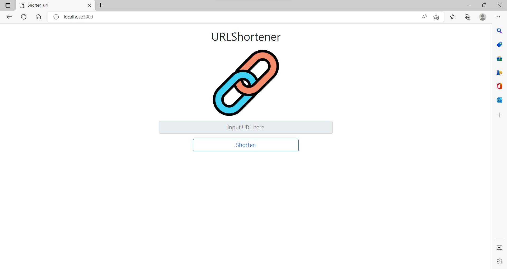

# 縮網址器



## 介紹

縮短長網址

### 功能

- 可輸入要轉換的網址
- 產生一組短網址

## 開始使用

1. 請先確認有安裝 node.js 與 npm
2. 將專案 clone 到本地
3. 在本地開啟之後，透過終端機進入資料夾，輸入:

   ```bash
   cd shorten_url
   ```
3-2. 新增.env檔案輸入環境參數，或是於本地新增:

   ```bash
   MONGODB_URI_S='Your MongoDB Account String'
   ```

4. 接著輸入'npm run start'執行渲染畫面:

   ```bash
   npm run start
   ```

5. 若看見"Express is running on http://localhost:3000"
   則代表順利運行打開瀏覽器進入到以下網址:

   ```bash
   http://localhost:3000
   ```

6. 若看見'mongodb connected'表示伺服器連線成功。
   
   ```bash
   mongodb connected!
   ```

7. 若欲暫停使用

   ```bash
   ctrl + c
   ```

## 開發工具

- Node.js 14.16.0
- Express 4.17.4
- Express-Handlebars 4.0.2
- Bootstrap 5.0.2
- Font-awesome 6.2.0
- body-parser 1.20.1
- mongoose 5.9.7


